## Introduction
Deep generative models have shown an incredible results in 
producing highly realistic pieces of content of various kind, 
such as images, texts, and music. The three most popular
generative model approaches are Generative Adversarial Networks (GANs), autoregressive models, 
and Variational Autoencoders (VAEs). However, this blogpost will only be focusing on VAEs.

### What are Variational Autoencoders?
Diagram of a Variational Autoencoder.

Variational Autoencoders are generative models with an encoder-decoder architecture.
Just like a standard autoencoder, VAEs are trained in an unsupervised manner 
where the reconstruction error between the input x and the 
reconstructed input x' is minimized. However, in order to introduce some regularization of the latent space, 
the input is encoded as a distribution over the latent space rather than encoded as a single point.

### Generating New Images
To generate a random, new sample that is similar to the training data, you can simply remove the encoder
portion of the VAE and randomly sample from the latent distribution. 
This will give you a latent vector z which can then be decoded using the decoder to 
produce the new sample x'.

## Math Derivation
Now that you have some intuition of how VAEs work, let's dive into the
maths behind VAEs!

### Kullback–Leibler Divergence
Let's first define the Kullback–Leibler (KL) divergence (also called relative entropy).
KL divergence is a measure of how one probability distribution is different from a second, 
reference probability distribution.

For discrete probability distributions P(x) and Q(x) defined on the same probability space,
the KL divergence from Q(x) to P(x) is defined as:

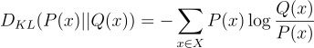

The KL divergence has the following properties:
1. 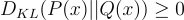

2. 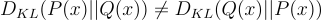

The first property will come in handy for later in the derivation and the proof can be found in 
[this post](https://stats.stackexchange.com/questions/335197/why-kl-divergence-is-non-negative).
The second property indicates that KL divergence is not symmetric and therefore, not a distance metric 
(hence why the term is called a "divergence").

### Variational Inference
VAEs sample values of z that are likely to have produced x. Intuitively, this can be done by sampling
from the posterior distribution p(z|x):

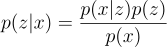

However, p(x) is intractable &mdash; therefore, making the whole term intractable:

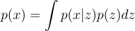

The solution to this issue is to use variational inference 
to approximate p(z|x) using a tractable distribution q(z|x).

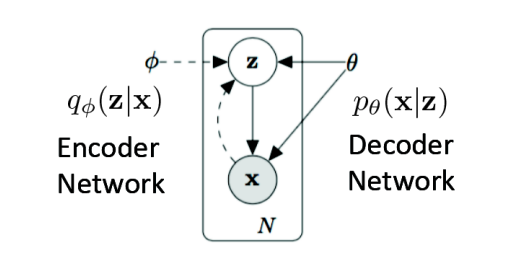  
The standard VAE directed graphical model.

### Objective Function
We can approximate p(z|x) with q(z|x) by minimizing the KL divergence from q(z|x) to p(z|x):

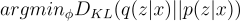  

Let's manipulate this equation such that
we can isolate for p(x) in a single term
(you'll see why later).

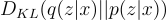  

  

Note: all summations are in terms of z.

Substitute p(z|x) using:
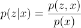 

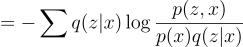

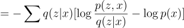  

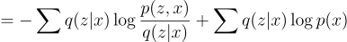  

Note that:

.png)  

Therefore, 

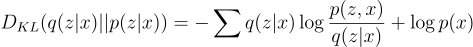  

Rearranging, we get:

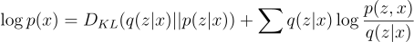  

Earlier we saw that p(x) is intractable, so how do we maximize 
the KL-divergence? We use the Evidence Lower Bound (ELBO)!

### Evidence Lower Bound
In ELBO, we call the likelihood function evaluated at &Theta; the evidence.

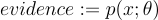 

The intuition behind why this quantity is called the "evidence"
is that if we have chosen the right model p and parameters &Theta;, 
then we should expect to see a high marginal probability of 
our observed data p(x; &Theta;).

ELBO is defined as the lower bound on the evidence:

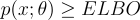 

The derivation of the ELBO is as follows (for now we will 
drop the &Theta; in the likelihood function to simplify the math a bit,
but assume that it's there):

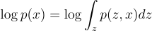

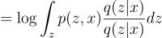

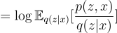

Now, we can use [Jensen's inequality](ht tps://en.wikipedia.org/wiki/Jensen%27s_inequality)
since we know that the logarithm function is strictly concave.

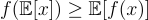

Earlier we saw that:

Plugging into Jensen's inequality, "f" is the logarithm function 
and "x" is the term p(z, x) / q(z | x):

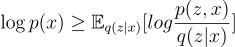

Now, we have solved for ELBO. So then what do we do with this? 
Notice how the KL divergence is the difference between log(p(x)) and ELBO:

We can visualize this as such:

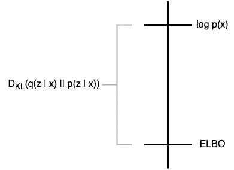

We know that:

1. ELBO is the lower bound of log(p(x)):
   

2. KL divergence must be greater or equal to zero:

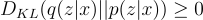

3. The objective is to minimize the KL divergence by learning 
the parameters of the variational distribution q and log(p(x)) does not depend on q. 
   
Therefore, we can conclude that by maximizing the ELBO, we are essentially minimizing the KL divergence.
You can visualize this by moving the ELBO upwards, closing in on the gap, and decreasing
the KL divergence.

Now let's rewrite the objective function such that 
it maximizes the ELBO:

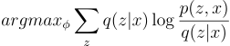

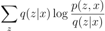

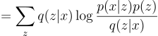

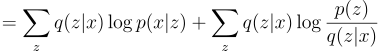

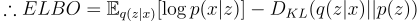

...and you're done! Just kidding, there's more!

Let's analyze what the above equation means.

### Etc.
VAEs make strong assumptions about the distribution of the latent variables:
* the prior is usually set to be the centred isotropic multivariate guassian p(z) = N(0, I)
* the shape of the variational and the likelihood distributions are also gaussians