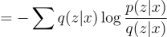

## Introduction
Deep generative models have shown an incredible results in 
producing highly realistic pieces of content of various kind, 
such as images, texts, and music. The three most popular
generative model approaches are Generative Adversarial Networks (GANs), autoregressive models, 
and Variational Autoencoders (VAEs). However, this blogpost will only be focusing on VAEs.

### What are Variational Autoencoders?
Diagram of a Variational Autoencoder.

Variational Autoencoders are generative models with an encoder-decoder architecture.
Just like a standard autoencoder, VAEs are trained in an unsupervised manner 
where the reconstruction error between the input x and the 
reconstructed input x' is minimized. However, in order to introduce some regularization of the latent space, 
the input is encoded as a distribution over the latent space rather than encoded as a single point.

### Generating New Images
To generate a random, new sample that is similar to the training data, you can simply remove the encoder
portion of the VAE and randomly sample from the latent distribution. 
This will give you a latent vector z which can then be decoded using the decoder to 
produce the new sample x'.

## Math Derivation
Now that you have some intuition of how VAEs work, let's dive into the
maths behind VAEs!

### Kullback–Leibler Divergence
Let's first define the Kullback–Leibler (KL) divergence (also called relative entropy).
KL divergence is a measure of how one probability distribution is different from a second, 
reference probability distribution.

For discrete probability distributions P(x) and Q(x) defined on the same probability space,
the KL divergence from Q(x) to P(x) is defined as:

The KL divergence has the following properties:
1. 

2. 

The first property will come in handy for later in the derivation and the proof can be found in 
[this post](https://stats.stackexchange.com/questions/335197/why-kl-divergence-is-non-negative).
The second property indicates that KL divergence is not symmetric and therefore, not a distance metric 
(hence why the term is called a "divergence").

### Variational Inference
VAEs sample values of z that are likely to have produced x. Intuitively, this can be done by sampling
from the posterior distribution p(z|x):

However, p(x) is intractable &mdash; therefore, making the whole term intractable:

The solution to this issue is to use variational inference 
to approximate p(z|x) using a tractable distribution q(z|x).

  
The standard VAE directed graphical model.

### Objective Function
We can approximate p(z|x) with q(z|x) by minimizing the KL divergence from q(z|x) to p(z|x).

  

  

  

Note: all summations are in terms of z.

Substitute p(z|x) using:
 

  

  

Note that:

.png)  

Therefore, 

  

Rearranging, we get:

  

Since we are optimizing for the parameters of q(z|x)
and log(p(x)) does not depend on q(z|x) we can treat it as a constant.

### Optimizing the Variational Lower Bound

### Etc.
VAEs make strong assumptions about the distribution of the latent variables:
* the prior is usually set to be the centred isotropic multivariate guassian p(z) = N(0, I)
* the shape of the variational and the likelihood distributions are also gaussians